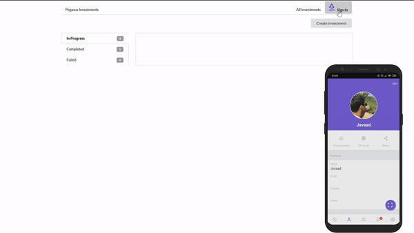
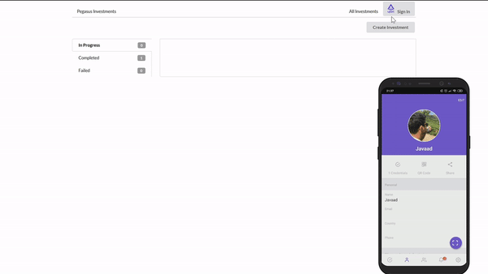
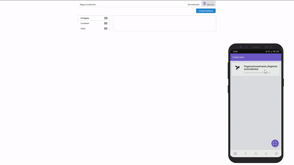
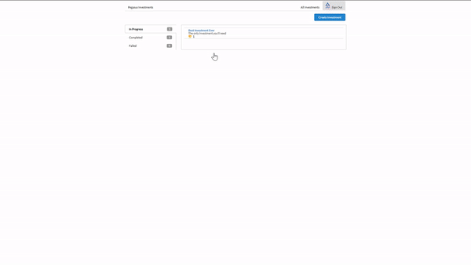
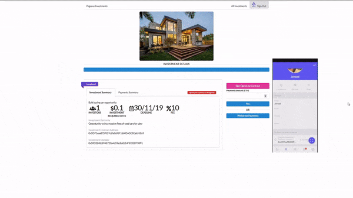
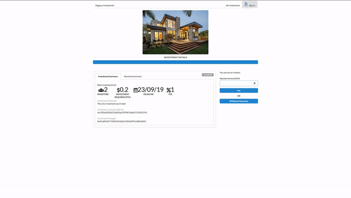
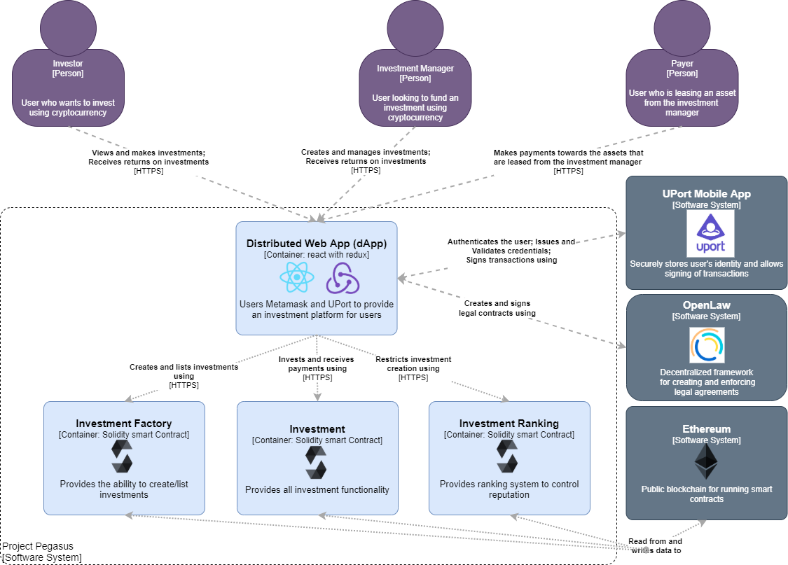

<p align="center">
  
</p>

# Project Pegasus
[](https://app.netlify.com/sites/projectpegasus/deploys)

## [Demo available](https://projectpegasus.netlify.com/)

The Pegasus Investments platform brings together investment managers and potential investors. The platform is built on the Ethereum blockchain with a combination of smart contracts, see [Architecture](#Application-architecture).

The investment managers [register](#Registration) on the platform using the UPort mobile app and can then [create investments](#Creating-an-investment) based on their investment ranking.

Investors can then invest their cryptocurrency (currently only ETH) into an investment they deem will be successful. 

Once fully funded, the investment manager can withdraw the funds to purchase the investment asset. Example use cases include, but are not limited to:

  - A house for rental income
  - A car to be used for uber drivers
  - A bond/stock that will receive dividends
  
The income from this investment is payed into the investment contract, which will then allocate a share of the income for each investor, depending on their initial investment amount. 

### Investment Ranking
The investment creation is constrained by the investment manager's rank, which is on a scale of 1 - 5. The rank of the investment manager specifies the maximum investment (required ETH) that can be created. This is used as a mechanism to vet investment managers, so that only highly reputable investment managers can create the largest investments.

The rank is related to the payments received into investments. As more payments (income) is paid into their investments, they can then upgrade their rank. 

The total allowed investment is calculated using the formula:
```
 totalAllowedInvestment = a(rank)^2 + b(rank) + c

 where:
    a = 50000;
    b = 49990;
    c = 0;
```

The ranking/reputation system is basic and is controlled via its own contract, see [Architecture](#Application-architecture), to allow for future upgrades and tuning.

### Registration
<p align="center">
  
</p>

In order to create investments, investment managers must register on the platform. This allows for later extensibility, if say investment managers first need to be vetted for something like KYC. 

By clicking **Sign In**, the investment manager can create an account (used to sign transactions) and will receive a registration credential, proving that they have gone through the registration process. This entire flow is enabled by the UPort mobile application.

> Only investment managers are required to register, but investors can also register if they wish to do their transactions through UPort.


### Sign In
<p align="center">
  
</p>

Once successfully registered, the user can click **Sign In**, at which point the application will request that the user shares their registration credential.

### Creating an Investment
<p align="center">
  
</p>

Investment managers can create an investment using the **Create Investment** button on the homepage which will take them to an investment creation form. 

In this form, the total investment is restricted by the investment managers current rank. They can **Upgrade** their rank on this screen as well, which would increase the total investment amount they can create an investment for.

They also need to specify the end date of the investment. If the investment does not get fully funded by this date, it's status will be moved to **Failed** which allows investors to withdraw their investment (less Gas).

### Investing
<p align="center">
  
</p>

Investors can browse the **In Progress** investments and see the associated ranking of the investment manager from the list of investments. Once they have found an investment which they would like to invest in, the can specify the amount they wish to invest and complete the transaction using MetaMask or, if logged in, using UPort. 

The investment will then reflect their investment amount and the percentage of the payment that they will receive once payments are made into this investment. They can withdraw payments using the **Withdraw Payment** button, which appears after the investment is successfully funded.

### Investment manager fund withdrawal

<p align="center">
  
</p>

The platform leverages the decentralized service, [OpenLaw](https://www.openlaw.io/ "OpenLaw Website"), in order to create and enforce legally binding agreements on the blockchain. 

Once the investment has been created, the investment manager will have to sign an OpenLaw contract before he/she will be able to withdraw the funds. This provides additional safety for investors as investment managers can be held legally accountable for any fraudulent activities.

The signing of the OpenLaw contract is split into two parts, in the first part the legal contract generated by OpenLaw will be signed and saved against the investment on the blockchain ensuring that only the investment maanger could have signed the agreement. In the second part, the investment manager receives an email requesting his/her signature on the OpenLaw contract, which they will then log onto the OpenLaw platform to sign.

Once the OpenLaw contract has been signed, the investment manager can withdraw the funds from the investment.


### Paying for asset
<p align="center">
  
</p>

Users who are leasing an asset from the investment manager, eg. a renter who is renting from the investment manager, can pay the owed amount into investment using the **Pay** button on the investment details page.

# Development

The project uses [Ethers.js](https://docs.ethers.io/ethers.js, "Ethers.js's Documentation") for convience in interacting with the Ethereum blockchain. In order to run the project, install all npm dependencies in both the root directory and the **app** subdirectory using `npm install` and populate the settings of the two configuration files:  
- **.env.example** - holds values relating to deployment of smart contracts
- **./app/.env.example** - holds api keys for accessing etherscan (used to poll transaction status when using uPort transactions) and **OpenLaw** credentials

Then rename each file from **.env.example** to **.env** so that the settings can be read from your environment using the `dotenv` package.

### Application Architecture
<p align="center">
  
</p>

### Testing
The tests are split into three sections (describe blocks):

- Investment Contract tests - These test functions on the **InvestmentFactory.sol** contract
- Investment Ranking Contract tests - These test functions on the **InvestmentRanking.sol** contract
- Time-Travel tests - These mainly test functions on the Investment Contract and are used to simulate a certain amount of time having passed (to replicate expiry of an investment deadline)

The tests can be run by first starting the local truffle develop blockchain instance using
```
truffle develop
```
and then running the tests using
```
truffle test
```

### Deployment
The contracts can be deployed to ropsten (more configurations can be added) by using:
```
truffle migrate --network ropsten 
```
This will output the contract addresses which need to be inserted into **app/src/configuration/index.js** 

### Netlify deployment command
If you would like to deploy the project using **Netlify**, the build command you can use is: 
```
npm install && npm install truffle && truffle compile && cd app && npm install && npm run build
```
This can also be simplified by adding a command to the **package.json** file and then executing that command as the build command.

### Launching
After the node modules have been installed using `npm install`. The application can then be run by using the command
```
npm run start
```

# Disclaimer
This project was built as part of the ETHCapeTown Hackathon, the code is not production ready. Also, having googled later, [Pegasus Investments](https://www.pegasusinvestments.com) is an actual company, this project has no relation to it at all.


# Contribution

PR's are more than welcome.
